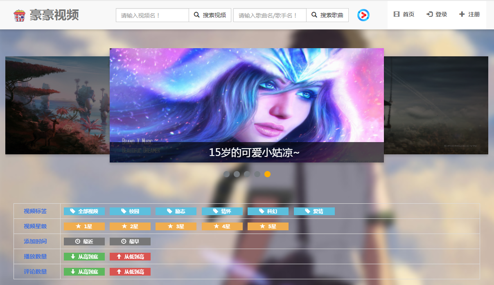
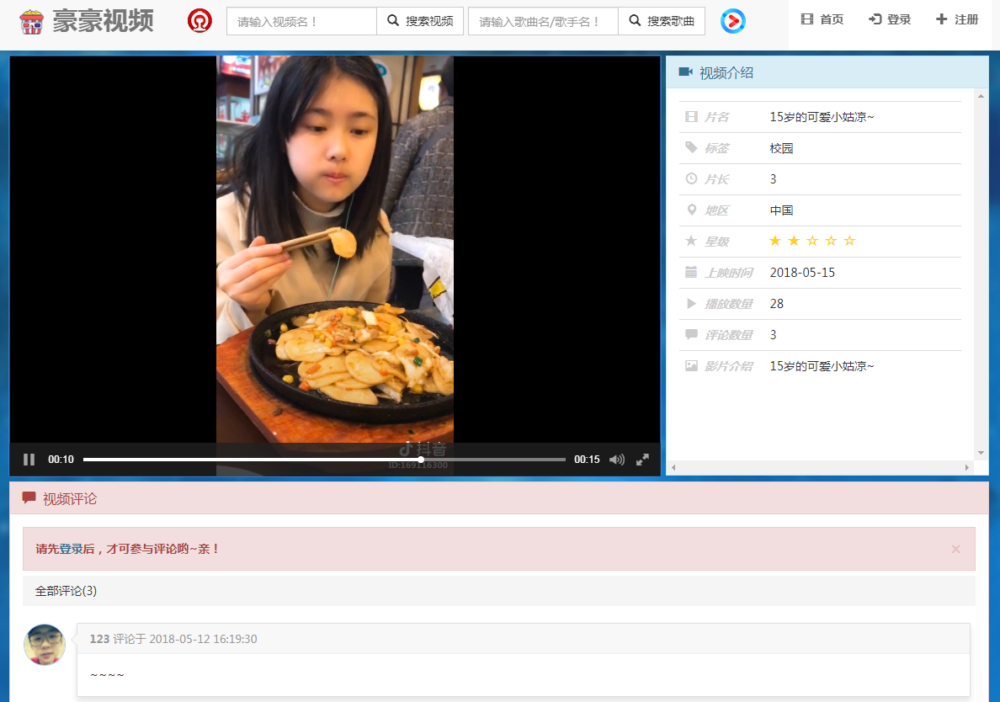
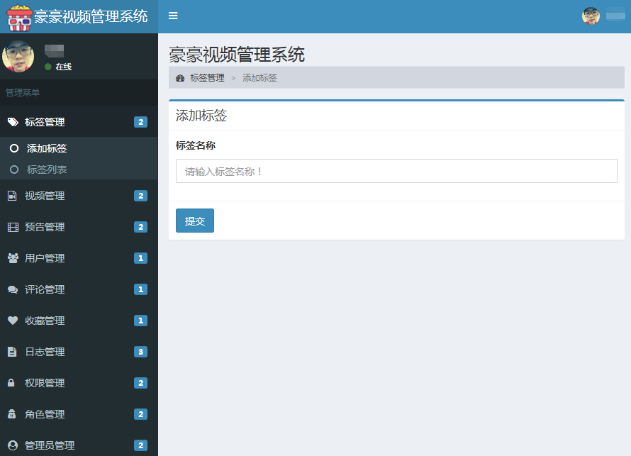
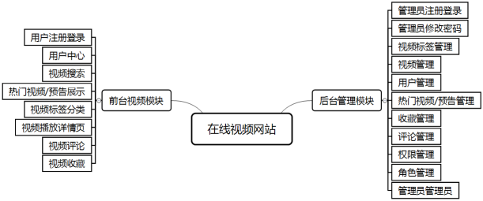
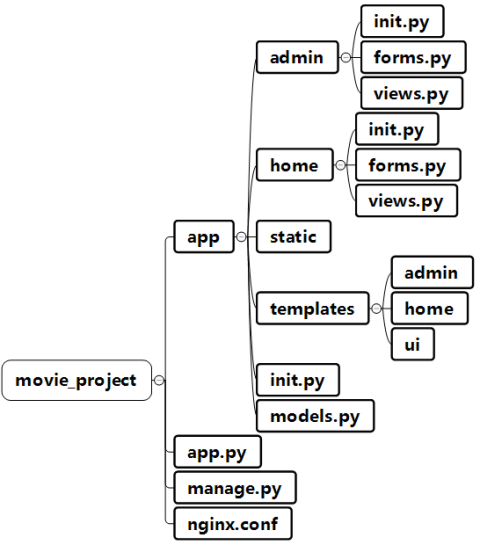
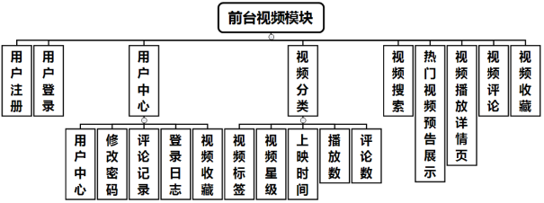
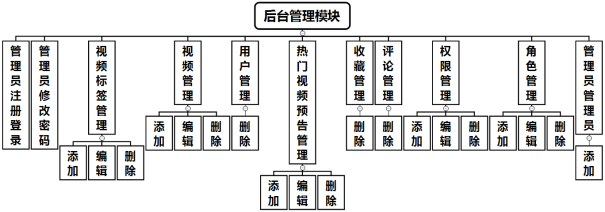
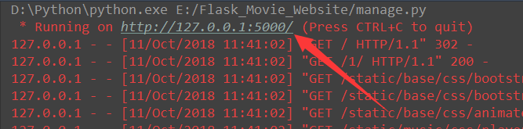

基于Python的Flask框架的在线电影网站系统 
===========================
         
### 网站展示 - http://henryhao.cn/
|Author|:sunglasses:Henryhaohao:sunglasses:|
|---|---
|Email|:hearts:1073064953@qq.com:hearts:

    
****
## :dolphin:声明
### 软件均仅用于学习交流，请勿用于任何商业用途！感谢大家！
## :dolphin:介绍
### 该项目为基于Python的Flask框架搭建的[在线电影网站](http://henryhao.cn/)
- **项目介绍**:网站前端采用HTML5编写，使用Bootstrap前端开发框架，后端使用Python3语言编写，以及Flask的Web框架，将MySQL作为数据库，开发工具使用PyCharm
- **网站功能**:网站前台模块具有浏览视频、搜索视频、筛选视频、登录注册、收藏评论等功能。后台模块具有对视频、用户、管理员等各类管理功能
- **项目文件**:整个movie_project目录
- **运行方法**:运行movie_project目录下的manage.py
- **nginx配置文件**:位于movie_project目录下的nginx.conf,用于部署到服务器进行反向代理的相关配置
## :dolphin:运行环境
Version: Python3
## :dolphin:安装依赖库
```
pip3 install -r requirements.txt
```
## :dolphin:项目截图
> - **首页展示图**<br><br>

> - **视频展示页**<br><br>

> - **视频播放页**<br><br>

> - **后台管理页**<br><br>

> - **整体架构设计图**<br><br>

> - **项目目录结构图**<br><br>

> - **前台功能模块图**<br><br>

> - **后台功能模块图**<br><br>

> - **本地运行图**<br><br>


